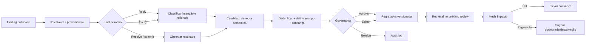

# Mira: análise competitiva e roadmap de produto

**Status:** proposta
**Atualizado em:** 2026-08-23
**Escopo:** experiência de review, aprendizado, automação, governança e operação self-hosted

## Resumo executivo

O Mira já tem um núcleo de review competitivo: contexto do repositório, grafo de dependências, comentários inline, review incremental, deduplicação, análise de segurança, contexto cross-repo, regras customizadas, dashboard, suporte a múltiplos provedores Git e BYO LLM. Além disso, a distribuição self-hosted multi-arquitetura é uma vantagem real para instalações pequenas e privadas.

O maior déficit não está em encontrar problemas. Está no ciclo que começa depois do achado:

1. um finding não possui identidade e proveniência duráveis;
2. reply e reação não viram sinais normalizados e confiáveis;
3. discordâncias não produzem aprendizado semântico útil;
4. o efeito de uma regra aprendida não é medido;
5. o usuário não consegue transformar um finding em correção ou policy check com um fluxo curto.

A recomendação é não tentar copiar todas as superfícies dos concorrentes de uma vez. O primeiro marco deve ser **Mira Learns Safely**: feedback inline completo, regras candidatas explicáveis, aprovação humana, aplicação com escopo e medição de eficácia. Depois vêm gate de merge orientado a risco, autofix seguro e integrações de CI/tickets.

## Posição atual do Mira

### Pontos fortes que devem ser preservados

- Review rápido com comentários inline, resumo/walkthrough, sugestões aplicáveis e processamento paralelo.
- Indexação completa, símbolos, dependências, relacionamentos, blast radius e contexto cross-repo.
- Filtros de ruído por confiança, severidade, categoria, autor, caminho e limite de comentários.
- Passes de segurança, OSV, self-critique, ensemble e ferramentas agentic opt-in.
- GitHub, GitLab e Forgejo.
- SQLite ou PostgreSQL, dashboard próprio e implantação self-hosted.
- BYO LLM: OpenAI-compatible, OpenRouter e Bedrock, com modelos separados por função.
- Regras manuais e aprendidas com aprovação administrativa.
- Imagem Docker `amd64`/`arm64`, atualização automática e rollback no Orange Pi.

### Lacuna funcional confirmada no aprendizado atual

O Mira já possui componentes de aprendizado, mas o principal caminho de falso positivo não fecha o ciclo:

1. [`run_thread_reply`](../src/mira/platforms/handlers.py) classifica uma resposta como `disagreement` e grava `signal="rejected"`.
2. Esse evento é salvo com `comment_category`, `comment_severity` e `comment_title` vazios.
3. [`synthesize_rules`](../src/mira/analysis/feedback.py) converte categoria vazia em `unknown` e ignora o evento.
4. No GitHub, uma resposta inline só inicia esse fluxo quando contém menção ao bot.

Consequência: o bot responde e resolve a thread, mas o feedback mais importante não vira uma regra. A interface aparenta aprendizado, enquanto o sinal fica inerte.

Há uma segunda fragilidade: no merge, um comentário do bot é inferido como `accepted` quando não existe rejeição na mesma combinação de caminho e linha. Merge não significa necessariamente que o finding foi aceito ou corrigido. Essa heurística tende a produzir falsos positivos de aceitação.

O modelo atual de dados também guarda apenas PR, caminho, linha, categoria, severidade, título, sinal e ator. Faltam, entre outros: ID estável do finding, ID do comentário/thread, SHA, corpo original, resposta humana, fingerprint semântico, versão do prompt/modelo, estado da thread e resultado observado.

## Mapeamento competitivo

O levantamento usa documentação oficial pública disponível em 2026-08-23. Ele cobre os produtos que representam os principais padrões do mercado; não é uma lista de todo bot existente.

### Líderes e seus diferenciais

| Produto | Feedback e aprendizado | Ação e gate | Diferencial relevante para o Mira |
|---|---|---|---|
| [CodeRabbit](https://docs.coderabbit.ai/llms.txt) | Converte replies inline em learnings de linguagem natural, confirma o aprendizado, registra metadados, usa busca vetorial e oferece escopos/CRUD/import/export. | Autofix na branch ou em PR empilhado; análise de CI; checks de pré-merge nativos e em linguagem natural; validação de issue; várias ferramentas estáticas. | É a referência mais completa para o ciclo `finding → conversa → memória → correção → gate`. |
| [Macroscope](https://docs.macroscope.com/llms.txt) | Reply, feedback por reação e instruções versionadas por glob. | “Fix It For Me” cria branch/commit/PR e acompanha CI; Approvability emite approval real usando eligibility, corretude, CODEOWNERS e caminhos sensíveis. | Melhor referência para aprovação conservadora e correção nunca diretamente na `main`. |
| [Greptile](https://www.greptile.com/docs/code-review/key-features) | Aprende com 👍, 👎, replies e ausência de reação; mede addressed rate e razão de reações. | Fix with Agent/Fix All, auto-approve por score/risco e validação em sandbox com testes gerados. | Referência para observabilidade do aprendizado e validação dinâmica de findings. |
| [Cursor Bugbot](https://cursor.com/blog/bugbot-learning) | Transforma reações, replies e comentários humanos em regras candidatas; promove regras com evidência e pode desativá-las quando deixam de ajudar. | Review local/PR, autofix por Cloud Agent e approval agents orientados a risco. | Referência para lifecycle contínuo de regras, não apenas criação pontual. |
| [Qodo](https://docs.qodo.ai/code-review) | Regras organizacionais e Rule Miner baseado no histórico de PRs. | Arquitetura multiagente, governança de código, skills e review local. | Referência para minerar convenções existentes antes de esperar feedback novo. |
| [Graphite](https://graphite.com/docs/ai-review-customization) | Regras por repositório/caminho e métricas de aceitação por regra; feedback em comentários. | Chat com contexto de PR, stack, CI e comentários; fluxo forte de stacked PRs e merge queue. | Referência de produtividade integrada ao fluxo de entrega, especialmente stacks. |
| [Ellipsis](https://docs.ellipsis.dev/features/code-review) | Aprende com 👍/👎/replies e infere regras do histórico e de arquivos de estilo, com escopo por path. | Pipeline extensível de reviewers e fix/review por commit. | Boa referência de feedback simples e configuração versionada no repo. |
| [Bito](https://docs.bito.ai/ai-code-reviews-in-git/overview) | Regras e contexto persistente por knowledge graph. | Reviews no Git e também locais/staged/uncommitted; integrações de análise estática e vulnerabilidade. | Referência para shift-left no IDE/CLI e combinação LLM + ferramentas determinísticas. |

### Reviewers nativos como baseline

- [GitHub Copilot code review](https://docs.github.com/en/copilot/how-tos/use-copilot-agents/request-a-code-review/use-code-review) oferece custom instructions por repositório/caminho, sugestões aplicáveis e feedback por comentário.
- [Gemini Code Assist](https://docs.cloud.google.com/gemini/docs/code-review/use-code-assist-github) oferece resumo, severidade, commit suggestions, style guide, slash commands e threshold.
- [GitLab Duo](https://docs.gitlab.com/user/gitlab_duo/code_review/) oferece review agentic, instruções customizadas e follow-up chat, mas declara que feedback não influencia reviews futuros.

Esses produtos definem o mínimo esperado dentro das próprias plataformas, mas o Mira pode se diferenciar por ser multiplataforma, self-hosted, controlável e barato de operar em ARM.

## Matriz de capacidades e gaps

Legenda: **forte** = já competitivo; **parcial** = existe, mas falta fechar o fluxo; **ausente** = não encontrado no produto atual.

| Capacidade | Mira hoje | Referência de mercado | Prioridade |
|---|---|---|---|
| Contexto completo do código | **forte** | CodeRabbit, Greptile, Bito | Manter |
| Cross-repo / blast radius | **forte** | CodeRabbit, Greptile, Qodo | Manter |
| Review incremental e deduplicação | **forte** | CodeRabbit, Graphite | Manter |
| BYO LLM e self-hosting | **forte** | Greptile Enterprise; raro no segmento | Diferencial |
| Imagem ARM de primeira classe | **forte** | Não é uma oferta comum dos SaaS | Diferencial |
| Conversa inline | **parcial** | Replies sem ritual e contexto persistente | P0 |
| Feedback por 👍/👎 | **ausente** | Greptile, Cursor, Ellipsis | P0 |
| Proveniência estável do finding | **ausente** | Necessária para qualquer learning confiável | P0 |
| Aprendizado semântico com escopo | **parcial** | CodeRabbit, Cursor, Qodo | P0 |
| Aprovação e lifecycle de regras | **parcial/forte** | Cursor, CodeRabbit | P0 |
| Medição de eficácia de regras | **ausente** | Greptile, Graphite, Cursor | P0 |
| Approval/gate orientado a risco | **parcial** | Macroscope, Greptile, Cursor | P1 |
| Autofix / handoff para agente | **ausente** | CodeRabbit, Macroscope, Greptile, Cursor | P1 |
| Checks customizados de pré-merge | **ausente** | CodeRabbit, Macroscope, Qodo | P1 |
| Leitura de logs/estado de CI | **ausente** | CodeRabbit, Graphite, Macroscope | P1 |
| Validação de ticket/issue | **ausente** | CodeRabbit, Bito, Graphite | P1 |
| Ferramentas estáticas amplas | **parcial** | CodeRabbit, Bito | P1 |
| Review local/CLI/IDE | **ausente** | Cursor, Bito, Qodo, CodeRabbit | P2 |
| Validação dinâmica em sandbox | **ausente** | Greptile | P2 |
| MCP e contexto externo | **ausente** | Greptile, Macroscope, Bito | P2 |
| Triage e roteamento de reviewer | **ausente** | CodeRabbit, Cursor, Graphite | P2 |
| Ações pós-merge | **ausente** | CodeRabbit | P3 |

## Produto-alvo

### Princípios

1. **Aprender um padrão, não decorar uma frase.** O texto humano é evidência; a regra precisa ser generalizada, explicável e limitada ao escopo correto.
2. **Nunca esconder o aprendizado.** Toda regra automática nasce candidata, mostra evidências e exige aprovação por padrão.
3. **Feedback não é binário por inferência.** Sem reação ou reply significa `unobserved`, não `accepted`.
4. **Identidade antes de inteligência.** Nenhum learning é confiável sem ligar o sinal ao finding exato e à versão do código.
5. **Fail closed para gates.** Falha de modelo, indexação ou webhook nunca deve resultar em approval automático.
6. **Automação reversível.** Autofix trabalha em branch e rollback de regra/configuração deve ser imediato.
7. **SQLite continua cidadão de primeira classe.** Toda evolução deve funcionar no Orange Pi sem exigir serviços adicionais.

### Fluxo desejado



## Arquitetura proposta

### 1. Identidade e proveniência

Criar um `finding_id` estável, por exemplo UUIDv7, e um `fingerprint` determinístico calculado com:

- repositório e PR;
- blob SHA/base SHA/head SHA;
- path e símbolo mais próximo;
- categoria e regra detectora;
- trecho normalizado do problema, sem depender apenas do número da linha.

O ID deve ser embutido de forma invisível no comentário (`<!-- mira:finding:... -->`) e persistido antes da publicação. IDs do comentário e da thread de cada plataforma são associados depois que a API responde.

### 2. Novas entidades

#### `review_findings`

- `id`, `fingerprint`, `review_id`, `platform`, `owner`, `repo`, `pr_number`;
- `base_sha`, `head_sha`, `path`, `start_line`, `end_line`, `symbol`;
- `category`, `severity`, `confidence`, `title`, `body`, `suggestion`;
- `detector`, `prompt_version`, `model`, `platform_comment_id`, `thread_id`;
- `state`: `open`, `resolved`, `dismissed`, `fixed`, `outdated`;
- timestamps.

#### `feedback_events_v2`

- `id` idempotente e `finding_id` obrigatório quando o sinal vem de finding;
- `kind`: `thumbs_up`, `thumbs_down`, `reply_agree`, `reply_disagree`, `reply_question`, `resolved`, `dismissed`, `fixed`, `reopened`;
- `actor`, `actor_role`, `raw_text`, `rationale`, `source_event_id`;
- `head_sha`, `thread_state`, timestamp e payload mínimo de auditoria;
- unique key por plataforma/evento para suportar retries de webhook.

#### `learning_candidates`

- regra proposta, rationale, escopo, exemplos positivos/negativos;
- IDs das evidências, embedding/fingerprint semântico e score de confiança;
- status `collecting`, `pending`, `approved`, `rejected`, `superseded`;
- versão do sintetizador e custo/tokens.

#### evolução de `learned_rules`

- `version`, `scope_type` (`repo`, `org`, `path`, `language`, `symbol`);
- `scope_value`, `origin_candidate_id`, `rationale` e `evidence_count`;
- `effective_from`, `disabled_at`, `supersedes_rule_id`;
- métricas: exposições, findings suprimidos/gerados, positivos, negativos e última avaliação.

#### `rule_evaluations`

- qual regra participou de qual review/finding;
- decisão tomada (`boost`, `suppress`, `instruction`);
- score antes/depois e outcome observado.

### 3. Serviços

Separar o domínio de learning do handler de plataforma:

```text
src/mira/feedback/
  models.py          # tipos e estados
  normalizer.py      # payload GitHub/GitLab/Forgejo -> FeedbackEvent
  classifier.py      # intenção/rationale de texto livre
  provenance.py      # finding/comment/thread lookup
  synthesis.py       # evento(s) -> candidato semântico
  deduplication.py   # merge de candidatos equivalentes
  lifecycle.py       # approve/edit/reject/version/disable
  retrieval.py       # regras relevantes para um review
  evaluation.py      # eficácia e sugestões de promoção/downgrade
```

Os adapters de plataforma apenas verificam assinatura/permissão, normalizam o evento e enfileiram o trabalho. A mesma regra de negócio atende GitHub, GitLab e Forgejo.

### 4. Processamento assíncrono durável

Para manter a instalação simples:

- criar uma tabela `jobs` com lease, tentativas, `available_at` e dead-letter;
- executar um worker no mesmo processo por padrão;
- permitir processo separado para instalações maiores;
- tornar todo webhook idempotente;
- não depender de Redis no perfil Orange Pi.

Isso evita fazer chamadas de LLM dentro do timeout do webhook e permite reprocessar feedback sem duplicar regras.

### 5. Retrieval de regras

No início do review:

1. filtrar regras por organização/repositório, glob, linguagem e categoria;
2. buscar similaridade semântica entre arquivos/diff e regras candidatas;
3. aplicar um orçamento máximo de regras por prompt;
4. registrar quais regras foram expostas e qual decisão influenciaram;
5. dar precedência a regras manuais e específicas sobre regras globais aprendidas.

SQLite pode começar com embeddings serializados e busca por cosseno em memória para um conjunto pequeno. PostgreSQL pode ganhar `pgvector` como otimização opcional, nunca como requisito.

## Plano de implementação

As estimativas abaixo são faixas para uma pessoa familiarizada com o código. Cada fase deve resultar em uma release utilizável e reversível.

### Fase 0 — estabilizar o baseline sincronizado (2–4 dias)

**Objetivo:** garantir que novas features não sejam construídas sobre regressões silenciosas.

- Corrigir ou classificar os testes que falham após o sync com upstream.
- Fixar a matriz suportada de Python e executar CI em Linux, que é o runtime real.
- Adicionar build/test multi-arch com smoke test da imagem `linux/arm64` sob QEMU.
- Testar migração SQLite com cópia de um banco real e rollback da aplicação.
- Publicar SBOM e provenance/assinatura para as imagens.
- Documentar a cadência de merge de `upstream/main` e manter mudanças locais em commits pequenos.

**Aceite:** CI verde em `amd64`; imagem ARM inicia, responde `/health` e abre o banco existente; rollback do updater continua funcionando.

### Fase 1 — feedback correto e finding estável (5–8 dias)

**Objetivo:** nenhuma discordância volta a ser perdida.

**Status:** implementada em agosto de 2026. O schema legado permanece disponível
para leitura; toda nova interação de finding usa o modelo v2.

- Adicionar `review_findings` e `feedback_events_v2` em SQLite e PostgreSQL.
- Persistir finding antes de postar e associar IDs de comentário/thread depois.
- Incluir `finding_id` oculto em todo comentário do Mira.
- Remover a exigência de menção quando a resposta é filha de um comentário do bot.
- Consumir reações 👍/👎 em GitHub e equivalentes disponíveis nas demais plataformas.
- Preservar reply, finding original, categoria, severidade e SHA.
- Trocar “merge sem rejeição = aceito” por `unobserved`; marcar `fixed` apenas com evidência de diff/thread.
- Responder imediatamente: “Entendi o feedback; registrei como falso positivo”, sem prometer regra ainda.
- Manter compatibilidade de leitura do schema antigo e criar backfill best-effort.

**Aceite:** reply de discordância sem menção e 👎 geram exatamente um evento ligado ao finding correto; retry de webhook não duplica; nenhum evento com proveniência incompleta vira regra automática.

#### Notas da implementação

- O engine grava cada finding antes do POST e só depois associa o ID remoto. O
  comentário carrega `<!-- mira:finding:<uuid> -->`, invisível na renderização.
- `feedback_events_v2` deduplica por plataforma + ID externo do evento. Eventos
  legados sem path, categoria ou SHA continuam auditáveis, mas recebem
  `provenance_complete = false` e não participam de síntese.
- Replies-filhas do GitHub e discussões inline do GitLab não exigem menção. O
  Forgejo usa o parent ID quando a versão instalada o fornece; sem parent ID,
  exige menção para não atribuir feedback à conversa errada.
- GitLab usa o `Emoji Hook` para `thumbsup`/`thumbsdown`. O GitHub não oferece um
  webhook de reações; o provider lê `reactionGroups` no snapshot GraphQL dos
  threads e os normaliza ao processar o merge. Forgejo não documenta um webhook
  equivalente, então reações não são inferidas nessa plataforma.
- Merge sem interação gera `unobserved`. `fixed` exige thread resolvido e nunca
  sobrepõe uma discordância ou reação negativa já registrada.
- A síntese automática no fechamento do PR foi removida desta fase. A criação e
  governança de candidatos fica exclusivamente para a Fase 2.

### Fase 2 — Mira Learns Safely (7–12 dias)

**Objetivo:** transformar sinais em regras úteis, explícitas e governadas.

**Status:** implementada em agosto de 2026, com auto-aplicação desativada por
padrão e compatibilidade de migração para regras anteriores.

- Sintetizar regra e rationale a partir do finding + resposta humana + contexto do código.
- Deduplicar semanticamente candidatos equivalentes.
- Inferir o menor escopo seguro: path/símbolo/linguagem/repo antes de organização.
- Exigir mais evidência para ampliar o escopo.
- Criar candidato `pending`, nunca regra ativa, no modo padrão.
- Mostrar no reply um link para o candidato e as evidências.
- Dashboard para comparar, editar, aprovar, rejeitar, versionar e desativar.
- Import/export em YAML versionável no repositório.
- Retrieval com prioridade manual > específica > global.
- Feature flags: `feedback_v2`, `learning_synthesis`, `learning_auto_apply` (última desligada por padrão).

**Aceite:** uma discordância produz candidato explicável; candidato aprovado afeta apenas reviews no escopo; usuário consegue provar no dashboard por que uma regra foi criada e onde foi aplicada.

#### Notas da implementação

- Discordâncias textuais, rejeições explícitas e reações negativas com
  proveniência completa geram `learning_candidates`; sinais incompletos ficam
  auditáveis, mas não alimentam a síntese.
- A classificação já usada para responder a threads propõe regra, rationale,
  confiança e escopo. Um fallback determinístico cobre rejeições e reações que
  não passam pelo classificador, sem acrescentar outra chamada de LLM ao
  webhook.
- A deduplicação usa fingerprint estável e similaridade de tokens, uma escolha
  previsível e leve para o perfil Orange Pi. Evidências equivalentes são
  agregadas no mesmo candidato.
- O escopo proposto é limitado a símbolo/path com uma evidência; linguagem,
  repositório e organização exigem respectivamente 3, 5 e 10 sinais por
  padrão. Ampliar uma regra aprendida continua sujeito ao mesmo limite.
- Candidatos ficam inativos até aprovação. O dashboard expõe rationale,
  exemplos, SHA/path/finding de origem e permite editar, aprovar ou rejeitar;
  editar uma regra aprovada cria uma nova versão e preserva a anterior como
  `superseded`.
- O retrieval filtra path, símbolo, linguagem, repositório e organização,
  limita o orçamento por review e ordena regras manuais antes das aprendidas e
  escopos específicos antes dos globais.
- Regras aprovadas podem ser importadas/exportadas no formato YAML v1; imports
  repetidos do mesmo fingerprint e escopo são idempotentes.
- `learning.feedback_v2` e `learning.learning_synthesis` permitem desligar a
  criação de candidatos. `learning.learning_auto_apply` permanece `false` por
  padrão e, quando explicitamente habilitada, ainda exige confiança alta e a
  quantidade mínima de evidências do escopo.

### Fase 3 — avaliação contínua e analytics (4–7 dias)

**Objetivo:** saber se o aprendizado melhora o produto.

**Status:** implementada em agosto de 2026, com registro de exposições ligado
por padrão, kill switch dedicado e nenhuma desativação automática de regra.

- Registrar exposição e decisão por regra.
- Medir addressed rate sem confundir merge com aceitação.
- Métricas de 👍/👎, replies, resolução, fix observado e findings repetidos.
- Painel por regra, categoria, repositório, autor e período.
- Detectar regras com regressão e sugerir downgrade/desativação; não desativar automaticamente no primeiro release.
- Export CSV/JSON e eventos de auditoria.

**Aceite:** é possível comparar 30 dias antes/depois de uma regra; toda métrica leva aos findings que compõem o número; regras sem evidência não recebem score positivo.

#### Notas da implementação

- `rule_evaluations` existe em SQLite e PostgreSQL com o mesmo formato. Cada
  exposição gera uma linha por review — a regra esteve em jogo mesmo sem
  produzir finding — e uma linha por finding que o escopo da regra cobre.
- A escrita é idempotente por `evaluation_key`, um hash de plataforma,
  repositório, PR, head SHA, regra, versão, decisão e finding. Retry de review,
  reentrega de webhook e workers concorrentes convergem para uma linha. O
  `review_id` fica fora da chave de propósito: um retry cria outra review, mas
  continua sendo a mesma exposição.
- A atribuição é por escopo e declarada como tal. Não dá para saber em qual
  linha do prompt o modelo se apoiou, então a avaliação registra só o que é
  verificável: a regra estava presente e o finding está no escopo dela. O
  casamento de escopo na atribuição é mais estrito que no retrieval: regra de
  linguagem ou símbolo só liga findings do arquivo que de fato carrega aquela
  linguagem ou símbolo, e falha fechada sem metadado — perder um vínculo é
  recuperável, um vínculo errado corrompe o score em silêncio.
- `unobserved` fica fora do numerador e do denominador do acceptance rate, então
  silêncio não sobe nem desce o score. Sem sinal decisivo a taxa é nula e o
  dashboard mostra travessão, nunca `0%`.
- `addressed` exige evidência concreta: thread resolvida (`fixed`/`resolved`) ou
  estado equivalente do finding. O estado `outdated` foi deixado de fora de
  propósito — ele só diz que o diff andou, que é exatamente o que um merge
  silencioso parece.
- O agregado e o detalhamento são gerados da mesma expressão de outcome,
  compartilhada pelos dois bancos. Filtrar a lista por um bucket devolve
  exatamente a contagem do agregado, por construção.
- A comparação antes/depois mede findings no escopo da regra, não as exposições
  dela: antes da ativação não havia exposição alguma. Janela incompleta, regra
  sem timestamp de ativação ou regra removida retornam `comparable: false` com
  a razão.
- A detecção de regressão exige mínimo configurável de exposições (20 por
  padrão) e maioria negativa entre sinais decisivos. Regras manuais são
  ignoradas. Nada é desativado automaticamente: aceitar, adiar ou descartar uma
  sugestão apenas grava auditoria.
- Endpoints e dashboard são admin-only, paginados e exportáveis em CSV/JSON.
  `learning.evaluation_analytics` desliga a gravação sem alterar o review, que
  já foi publicado quando o registro acontece.
- Detalhes em [docs/rule-evaluation-analytics.md](rule-evaluation-analytics.md).

### Fase 4 — merge gate orientado a risco (6–10 dias)

**Objetivo:** evoluir o verdict atual para uma decisão conservadora e auditável.

- Criar risk score separado do score de qualidade do review.
- Eligibility por branch, label, autor, tamanho, arquivos gerados e status de CI.
- Protected paths e integração opcional com CODEOWNERS.
- Estados explícitos: `approved`, `would_approve`, `not_approved`, `skipped`, `error`.
- Fail closed quando review/index/LLM falha ou fica incompleto.
- Comentários blocker configuráveis como `REQUEST_CHANGES`; nunca aprovar com blocker aberto.
- Dry-run com `would_approve` antes de habilitar approvals reais.
- Histórico de decisão e override administrativo.

**Aceite:** caminho protegido nunca recebe auto-approval; falha de componente nunca aprova; o dry-run explica cada decisão e permite calcular falsos approvals antes do rollout.

### Fase 5 — correção assistida segura (8–15 dias)

**Objetivo:** fechar `finding → fix → CI` sem dar escrita perigosa ao reviewer.

- Comando `@mira fix` em um finding e `@mira fix all` no PR.
- Criar sempre branch/commit; nunca escrever diretamente na default branch.
- Preferir commit na branch do PR apenas com permissão/configuração explícita.
- Modo padrão: abrir PR filho/empilhado com diff e rationale.
- Executar formatters/testes configurados, limitar tempo/CPU/memória e anexar resultados.
- Repetir a correção no máximo N vezes com base no CI.
- Permissões mínimas, allowlist de comandos, proteção contra prompt injection no código/logs.
- Botão de handoff para agente externo como integração opcional antes de construir um agente completo.

**Aceite:** usuário consegue corrigir um finding em um clique/comando; toda mudança é revisável/reversível; secrets não entram no contexto; falha de teste impede automerge.

### Fase 6 — checks e contexto operacional (10–18 dias)

**Objetivo:** cobrir o que o diff isolado não prova.

- Framework de checks de pré-merge com `off`, `warning` e `error`.
- Checks nativos: descrição/título, docs, testes, breaking change e migrations.
- Checks em linguagem natural com path globs e evidência citada.
- Validação de GitHub/GitLab issue e critérios de aceite.
- Leitura e resumo de CI failures com adapters por provedor.
- Plugins determinísticos graduais: Semgrep, Ruff/ESLint, Gitleaks e OSV, sem duplicar comentário.
- Configuração central com herança de organização e override por repositório.

**Aceite:** cada check é independente, reproduzível e mostra evidência; falha do check distingue erro de infraestrutura de violação real; ferramentas determinísticas e LLM deduplicam o mesmo achado.

### Fase 7 — expansão de superfície (posterior, por demanda)

- CLI para review de diff local/staged/commit range usando o mesmo engine.
- MCP server read-only para findings, regras e contexto indexado.
- Triage e sugestão de reviewer com CODEOWNERS + histórico, sem atribuição automática inicialmente.
- Runtime validation em sandbox para findings de alta incerteza.
- Ações pós-merge e geração de changelog/docs.
- Suporte específico a stacks apenas se a base de usuários justificar.

Esses itens têm valor, mas não devem atrasar o ciclo de aprendizado e o autofix.

## Backlog priorizado

| ID | Entrega | Prioridade | Dependência |
|---|---|---:|---|
| FB-001 | Schema `review_findings` e migrations SQLite/Postgres | P0 | — |
| FB-002 | Fingerprint e metadata oculta no comentário | P0 | FB-001 |
| FB-003 | Normalizador idempotente de feedback | P0 | FB-001 |
| FB-004 | Reply filho sem exigir menção | P0 | FB-002 |
| FB-005 | Reações GitHub; matriz de suporte GitLab/Forgejo | P0 | FB-003 |
| FB-006 | Remover inferência de aceitação por merge | P0 | FB-003 |
| FB-007 | Job queue durável em banco | P0 | FB-003 |
| LR-001 | Síntese semântica de candidato | P0 | FB-001–007 |
| LR-002 | Deduplicação e escopo mínimo seguro | P0 | LR-001 |
| LR-003 | CRUD/versionamento/audit log | P0 | LR-001 |
| LR-004 | YAML import/export | P1 | LR-003 |
| LR-005 | Retrieval e registro de exposição | P0 | LR-003 |
| AN-001 | Addressed/reaction/repeat-FP metrics | P0 | LR-005 |
| AN-002 | Avaliação e sugestão de downgrade | P1 | AN-001 |
| GT-001 | Risk score e eligibility | P1 | Fases 1–3 |
| GT-002 | Protected paths/CODEOWNERS/dry-run | P1 | GT-001 |
| FX-001 | Fix de um finding em branch | P1 | FB-002 |
| FX-002 | Fix All + testes + CI loop limitado | P1 | FX-001 |
| CK-001 | Framework de pre-merge checks | P1 | GT-001 |
| CK-002 | Ticket e CI context adapters | P1 | CK-001 |
| TL-001 | Semgrep/Ruff/ESLint/Gitleaks adapters | P1 | CK-001 |
| DX-001 | CLI de review local | P2 | Engine estabilizado |
| MCP-001 | MCP read-only | P2 | LR-003 |
| SB-001 | Sandbox validation | P2 | FX-001 |

## Métricas de sucesso

### Qualidade

- taxa de findings com 👍, 👎, reply, fix ou resolução observável;
- false-positive rate explícito por categoria e regra;
- taxa de repetição de um falso positivo semanticamente equivalente;
- addressed rate com definição auditável;
- blockers encontrados antes do merge e escapes confirmados depois do merge.

### Aprendizado

- tempo entre feedback e candidato;
- taxa de aprovação/edição/rejeição dos candidatos;
- precisão posterior de cada regra;
- número de exposições necessário antes de sugerir ampliação ou desativação;
- percentual de regras com evidência e escopo válidos.

### Operação

- latência p50/p95 por review e por pass;
- taxa de reviews incompletos/skipped/erro;
- tokens e custo por finding útil;
- backlog/retry/dead-letter de jobs;
- uso de memória, CPU e espaço em disco no perfil Orange Pi;
- tempo e taxa de sucesso de update/health check/rollback ARM.

Metas iniciais devem ser definidas depois de 30 dias de baseline. A primeira meta de produto recomendada é reduzir em 50% a repetição de falsos positivos já rejeitados, sem aumentar escapes de severidade alta.

## Segurança, privacidade e governança

- Só aceitar feedback de usuários com acesso ao repositório; configurar quais papéis podem ensinar regra organizacional.
- Tratar texto de PR, código, logs e replies como entrada não confiável e resistente a prompt injection.
- Guardar apenas o payload necessário; configurar retenção e redaction de secrets/PII.
- Não enviar código a um modelo diferente do provedor autorizado para aquele repositório.
- Separar permissão de review, escrita em branch, approval e administração de regras.
- Assinar/verificar webhooks, manter idempotência e rate limits.
- Exibir modelo, versão do prompt, evidências e ator em todo candidato/regra.
- Oferecer kill switch global para learning, approvals e autofix.
- Fazer backup do SQLite antes de migrations e manter compatibilidade de rollback por pelo menos uma release.

## Estratégia de rollout

1. **Shadow:** gravar findings/feedback v2 sem mudar review nem regras.
2. **Candidate only:** sintetizar candidatos visíveis apenas no dashboard.
3. **Opt-in por repositório:** aplicar regras aprovadas e registrar resultados.
4. **Default on, governed:** candidatos por padrão; aplicação somente após aprovação.
5. **Automação progressiva:** dry-run de gate, depois approval em repos de baixo risco; autofix separado.

Cada etapa precisa de comparação contra um grupo controle e rollback por feature flag. O Orange Pi deve receber primeiro releases etiquetadas/canary; a tag `edge` só avança após smoke test multi-arch.

## Estratégia de upstream e ARM

- Manter `origin` como fork e `upstream` como repositório oficial.
- Sincronizar via merge explícito de `upstream/main`; não reescrever a história publicada do fork.
- Isolar customizações em módulos e commits pequenos para reduzir conflitos futuros.
- Manter a diferença de workflows limitada a QEMU/Buildx, plataformas e tags de imagem.
- Executar CI antes de publicar `edge`; o Orange Pi continua protegendo a atualização com health check e rollback.
- Criar teste automatizado que falha se `linux/arm64` desaparecer dos workflows de edge/release.
- Enviar features potencialmente úteis ao projeto original quando isso reduzir a superfície local de manutenção.

## Decisão recomendada para o próximo ciclo

Construir somente as Fases 0–3 como primeiro épico. Esse recorte entrega a feature que motivou o projeto — “o Mira aprende quando eu explico um falso positivo” — com proveniência, governança e métricas suficientes para não transformar feedback casual em degradação permanente.

Gate, autofix e integrações passam a ser muito mais seguros depois que findings, eventos e outcomes têm identidade durável. Começar por eles antes da fundação de feedback repetiria o problema atual em uma superfície com permissão de escrita.

## Referências oficiais

- CodeRabbit: [Learnings](https://docs.coderabbit.ai/knowledge-base/learnings), [PR reviews](https://docs.coderabbit.ai/overview/pull-request-review), [pre-merge checks](https://docs.coderabbit.ai/pr-reviews/pre-merge-checks), [autofix](https://docs.coderabbit.ai/finishing-touches/autofix)
- Macroscope: [bug detection and fixes](https://docs.macroscope.com/bug-detection-and-fixes), [custom instructions](https://docs.macroscope.com/custom-instructions), [Fix It For Me](https://docs.macroscope.com/fix-it-for-me), [Approvability](https://docs.macroscope.com/approvability)
- Greptile: [key features](https://www.greptile.com/docs/code-review/key-features), [learning](https://www.greptile.com/docs/code-review/training-the-learning-system), [analytics](https://www.greptile.com/docs/analytics), [auto-approve](https://www.greptile.com/docs/code-review/auto-approve-prs), [cross-repo](https://www.greptile.com/docs/code-review/cross-repo-context)
- Cursor: [Bugbot docs](https://cursor.com/docs/bugbot), [learning system](https://cursor.com/blog/bugbot-learning)
- Qodo: [Code Review](https://docs.qodo.ai/code-review), [documentação completa](https://docs.qodo.ai/llms.txt)
- Graphite: [AI reviews](https://graphite.com/docs/ai-reviews), [customization](https://graphite.com/docs/ai-review-customization), [AI review comments](https://graphite.com/docs/ai-review-comments), [Graphite Chat](https://graphite.com/docs/graphite-chat)
- Ellipsis: [Code Review](https://docs.ellipsis.dev/features/code-review)
- Bito: [AI Code Review Agent](https://docs.bito.ai/ai-code-reviews-in-git/overview), [IDE reviews](https://docs.bito.ai/ai-code-reviews-in-ide/overview)
